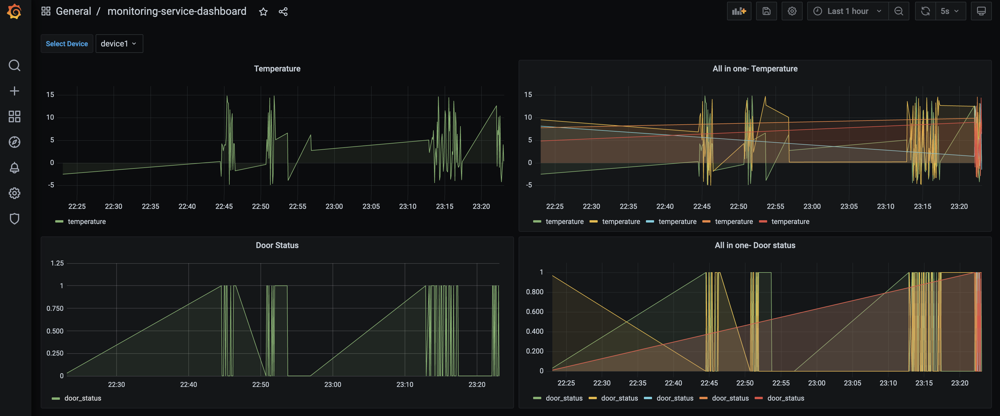
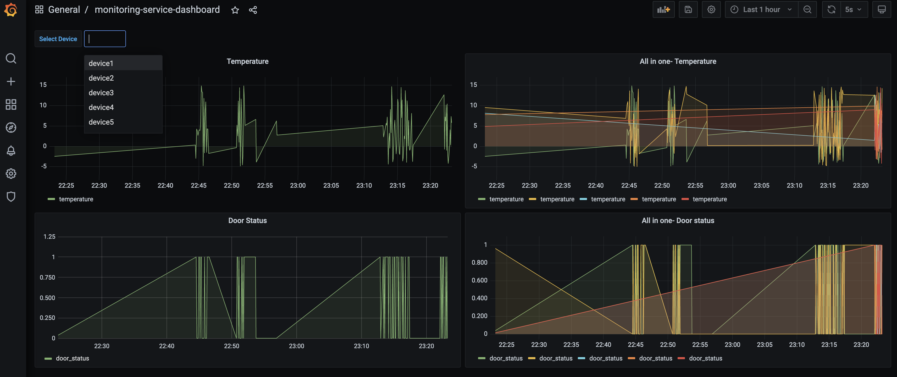
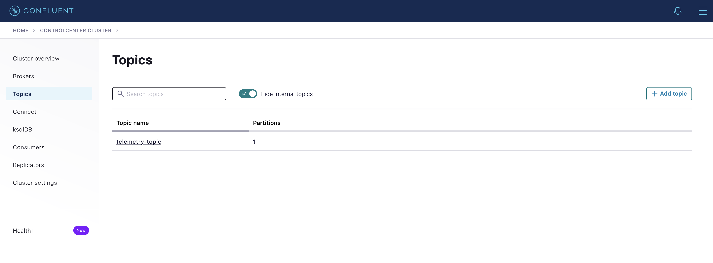

# Monitoring Service

Airtainer Monitoring service collects telemetry data from a bot python producer, routes it through Kafka and a java 
consumer client and persists it in PostGres database. Finally there is grafana dashboard enabling real time monitoring.

The service has following components:

### Data producer (python)

- Checkout repo
- cd to `{project root}/event-producer`
- `python3 -m venv .venv` # create a virtualenv
- `source .venv/bin/activate`
- `pip3 install -r requirements.txt`
- `python3 app.py -cf config.ini`

`config.ini` contains properties needed for connecting to Kafka cluster.

### Kafka message queue
It is run as a docker container, configuration is setup in provided docker-compose file

### Data consumer (java)
### Postgres database
### Grafana for real time monitoring.

## Dependencies
**Note:** the setup has been tested on MacOS with python3, docker(compose). It needs both these technologies to be run.

## Run instructions

### Setup service mesh
- Checkout repo
- from root directory, run `docker-compose up -d`

### Run event producer
- cd to `{project root}/event-producer`
- `python3 -m venv .venv` # create a virtualenv
- `source .venv/bin/activate`
- `pip3 install -r requirements.txt`
- `python3 app.py -cf config.ini`
- `python3 app.py -cf config.ini --devices 2 --interval 6 --event-count 20`

### Real time monitoring using Grafana
- In browser, go to `localhost:3000`, and open dashboard "General -> Monitoring service dashboard"

### Debugging
- Open Confluent control center at `localhost:9021`, this tool provides visibility into topic operations such as message
publishing and consumption etc

- Check logs using `docker-compose logs -f`

## Attributions
Following resources were consulted during the course of development
- https://towardsdatascience.com/how-to-build-a-simple-kafka-producer-and-consumer-with-python-a967769c4742
- https://www.confluent.io/blog/kafka-listeners-explained/
- https://github.com/dpkp/kafka-python
- https://medium.com/analytics-vidhya/grafana-with-postgresql-data-visualization-with-open-source-tool-36f5150fa290
- https://grafana.com/docs/grafana/latest/datasources/
- https://stackoverflow.com/questions/26598738/how-to-create-user-database-in-script-for-docker-postgres
- https://rmoff.net/2018/08/02/kafka-listeners-explained/
- https://www.confluent.io/blog/kafka-listeners-explained/
- https://github.com/rmoff/kafka-listeners/blob/master/docker-compose.yml
- https://limascloud.com/2022/01/02/docker-compose-kafka-setup-confluent-cloud/
- https://www.conduktor.io/kafka/complete-kafka-consumer-with-java
